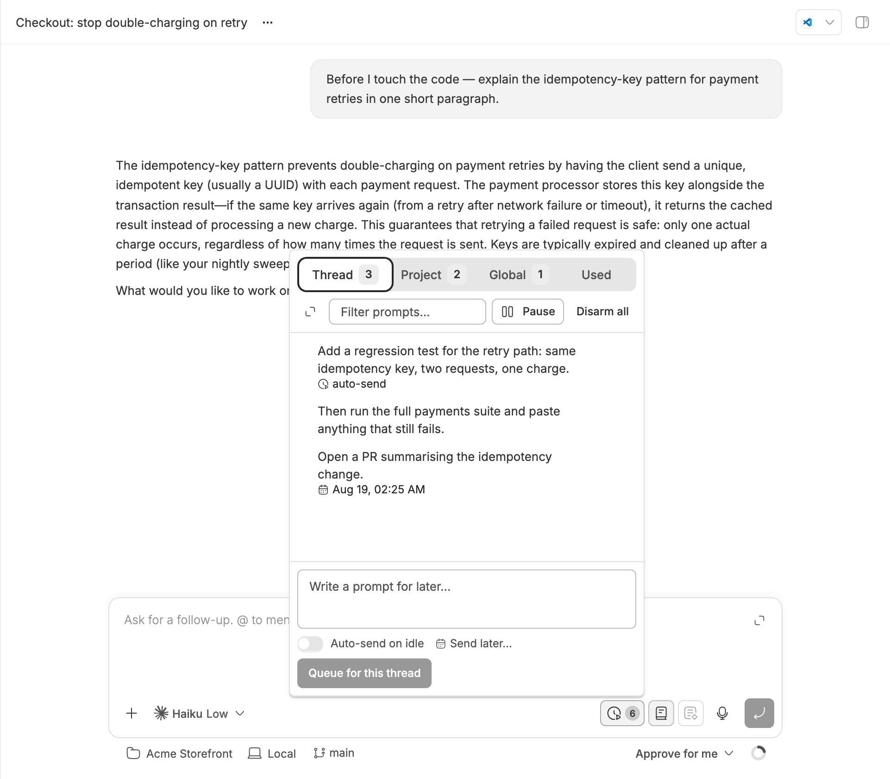
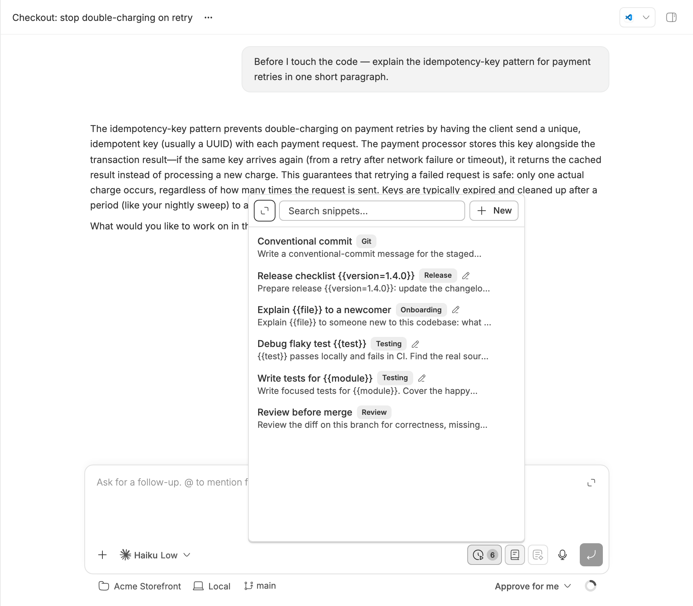
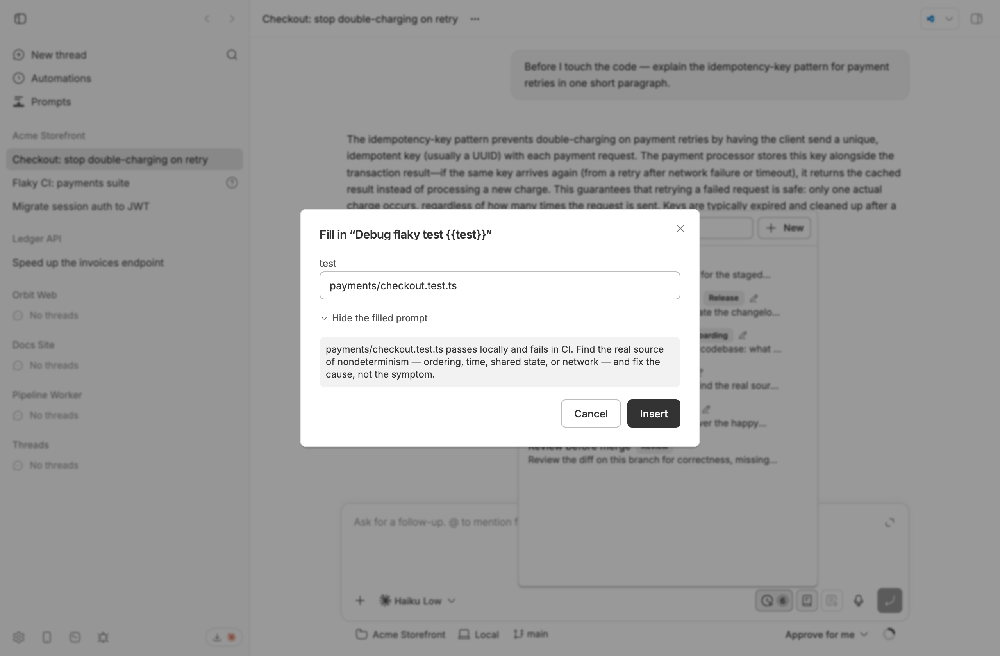
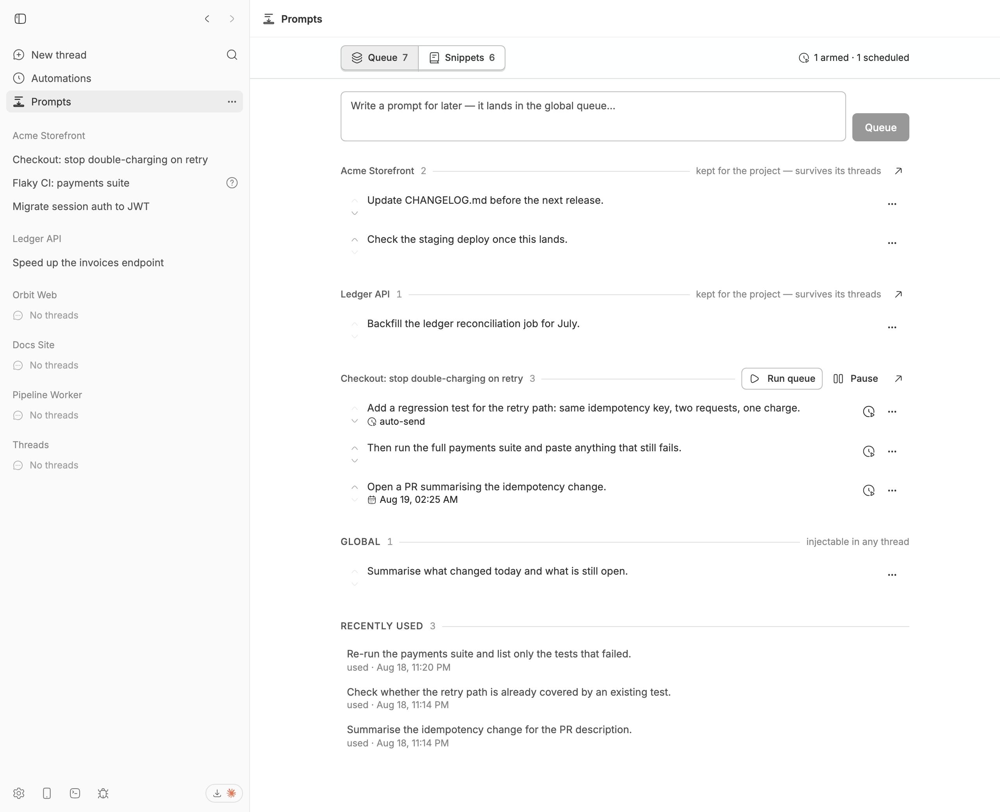

<div align="center">

# Prompts

**Stash prompts while the agent works. Keep the ones you retype.**

A prompt queue and a snippet library for [bb](https://getbb.app), sharing one
SQLite database and one composer row.

</div>

<picture>
  <source media="(prefers-color-scheme: dark)" srcset="assets/screenshots/queue-dark.png">
  
</picture>

You think of the next three steps while the agent is still on the first one.
Interrupting derails the turn; a scratch file gets lost; "I'll remember" does
not survive lunch. So write them down where the agent can reach them, and let
them go when it is ready.

- **Queue** — one-shot prompts you write now and use later. Inject one into the
  composer, send it to any thread, arm it to fire when the agent goes idle, or
  book it for a time.
- **Snippets** — reusable, titled prompts with `{{fill-in}}` tokens. Inserting
  one never consumes it. The plugin also reads bb's own prompt history and
  offers to turn the things you keep retyping into snippets.

## Install

```sh
bb plugin install prompts                                           # from the bb-community marketplace
bb plugin install git:https://github.com/vburojevic/bb-plugin-prompts.git   # straight from source
```

Requires bb `>=0.36`. Nothing leaves your machine: one SQLite file under the
plugin's own data directory, no network calls, no telemetry.

## The queue

Every composer gets a pill. Its badge counts everything reachable from where
you stand — this thread, this project, and global — and its colour tells you
whether anything is about to happen without you opening it.

Prompts wait for you by default. Two ways to make one leave on its own:

- **Auto-send on idle** — arm it, and it goes when the agent next finishes.
- **Send later** — pick a time (15m, 1h, 3h, tomorrow 9am, or an exact time).
  A scheduled prompt sends even if the agent is busy; the message queues on the
  thread.

Both are visible on the row, so a queue never does something you cannot see it
about to do.

## Snippets

<picture>
  <source media="(prefers-color-scheme: dark)" srcset="assets/screenshots/snippets-dark.png">
  
</picture>

Titled, grouped, searchable, and never consumed by use. Reach one from the
snippet pill, from the `+` menu as *Save draft as snippet*, or by typing `@` or
`~` in the composer — a mention resolves its body fresh at send time, so
editing the snippet changes what the next send says.

`bb prompts suggest` (and the Suggestions row in the panel) mines bb's prompt
history, clusters the prompts you keep retyping, and offers them as snippets
with the varying parts already turned into tokens.

## Fill-ins

<picture>
  <source media="(prefers-color-scheme: dark)" srcset="assets/screenshots/fill-ins-dark.png">
  
</picture>

`{{branch}}` asks for a value. `{{env=staging}}` asks with `staging` already
filled in. The dialog remembers the last value you gave each token name, so the
second time you use a snippet with `{{branch}}` it is already there — and it
shows you the finished prompt before it goes anywhere.

## Every queue in one place

<picture>
  <source media="(prefers-color-scheme: dark)" srcset="assets/screenshots/manager-dark.png">
  
</picture>

The **Prompts** nav panel is every queue at once: each project's queue, each
thread's queue with its own *Run queue* and *Pause*, the global queue, the
snippet library with its mined suggestions, and the prompts you recently sent
or injected — still there, ready to restore.

## Scopes: where a prompt lives

| Scope       | Belongs to  | Can arm / schedule | Reachable from     |
| ----------- | ----------- | ------------------ | ------------------ |
| **thread**  | one thread  | yes                | that thread        |
| **project** | one project | no                 | every thread in it |
| **global**  | nothing     | no                 | everywhere         |

Only a thread has an idle event, so only thread-scoped prompts can auto-send or
be scheduled.

Adding a snippet to the queue puts it in **the most specific queue you are
standing in** — this thread if you are in one, otherwise this project, otherwise
global. The row menu's *Add to queue* submenu names all three, and *Queue in
another thread* reaches any other thread without leaving the panel.

**A thread ending is not the end of its prompts.** When a thread is archived or
deleted, everything still queued for it moves to its project's queue, tagged
with the thread it came from — so the next session in that project still has
your writing. Set `threadEnd` to `delete` if you would rather they went with the
thread.

## Reading the composer pill

States are strictly ordered — the most urgent one wins:

| State         | Looks like                        | Means                                                |
| ------------- | --------------------------------- | ---------------------------------------------------- |
| **idle**      | plain outline, no count           | nothing queued here                                  |
| **queued**    | solid count chip                  | prompts waiting; nothing sends on its own            |
| **scheduled** | accent tint, calendar glyph       | a send is booked for a time                          |
| **armed**     | accent tint, clock glyph (pulses) | sends when the agent finishes; pulses while it works |
| **paused**    | dashed outline, pause glyph       | armed prompts deliberately held                      |
| **failed**    | red tint, alert glyph             | a send failed; the prompt is still queued            |

Hovering names the specifics — "1 prompt will send when the agent finishes · 2
for this thread", "next send in 3 hours (Aug 13, 02:50 PM)" — and that same
sentence is the button's accessible name.

## Auto-send, carefully

Arming a prompt means "send this when the agent finishes". `thread.idle` also
fires when the agent stops to ask *you* something, so an armed prompt waits out
`autoSendDelaySeconds` first, and anything that puts the thread back to work
cancels it. A failed thread never goes idle at all, so the plugin pauses that
thread's queue and says so rather than leaving prompts waiting forever.

Claims are atomic: a duplicate idle event, the cron sweep, and the UI can race
freely and a prompt still sends exactly once. A failed send re-queues the prompt
with the error attached.

## bb's own queue

bb has a native per-thread message queue that auto-delivers at the next turn
boundary. This plugin bridges to it: **push** a stashed prompt into it, or
**stash** one back out to stop it delivering. Copy-then-delete, so a message can
never be lost in the handoff.

## Agent tools

`prompts_queue`, `prompts_list`, `prompts_snippets`, `prompts_snippet_get`,
`prompts_snippet_save`. The point of the first one: when you tell an agent
"later", it stashes the follow-up instead of starting it or forgetting it.

Agents also see a short instruction block naming how many prompts are waiting
for the thread and the project.

## CLI

```
bb prompts list [--json]                 # thread + project + global
bb prompts add [-p|-g] [--arm] [--at +5m|ISO] <text…>
bb prompts send <id>                     # send to this thread now
bb prompts push <id>                     # move into bb's native queue
bb prompts stash                         # pull bb's queued messages into the stash
bb prompts arm|disarm <id>
bb prompts run                           # arm the whole thread queue
bb prompts pause | resume
bb prompts promote [<id>]                # keep for the project, past this thread
bb prompts rm <id>
bb prompts snips [query] [--json]
bb prompts snip-add --title <t> [--keywords <k>] [--group <g>] [--project] <body…>
bb prompts snip-show <id> [--set key=value …]
bb prompts snip-rm <id>
bb prompts group <name> [-p|-g]          # queue a whole group, in writing order
bb prompts suggest [--refresh] [--json]
```

`--` ends option parsing, so `bb prompts add -- -g starts the text` queues text
beginning with a dash.

## Settings

| Key                    | Default                | Meaning                                  |
| ---------------------- | ---------------------- | ---------------------------------------- |
| `autoSendDelaySeconds` | `20`                   | Grace period before an armed prompt sends |
| `threadEnd`            | `keep for the project` | Archived/deleted thread: promote or delete |
| `mineHistory`          | `on`                   | Scan prompt history to suggest snippets   |

```sh
bb plugin config prompts
bb plugin config prompts set autoSendDelaySeconds 10
```

## Development

```sh
npm install          # once
npm test             # vitest
npm run typecheck    # tsc --noEmit (server + app)
bb plugin build      # dist/server.js + dist/app.js
bb plugin reload prompts
npm run screenshots  # re-shoot the images above against a demo bb
```

The tests drive real SQLite, so `better-sqlite3`'s native binding has to match
the Node running them. Switching Node versions (a `mise` shell vs a Homebrew
one) breaks it with a `NODE_MODULE_VERSION` mismatch; `npm rebuild
better-sqlite3` under the Node you test with fixes it.

Layout:

```
server.ts           factory: settings, rpc, events, schedule, tools, mentions, cli
lib/contract.ts     the rpc contract + the DTO types the frontend imports
lib/store.ts        SQLite: queue, snippets, thread state, fill-in values
lib/operations.ts   send / stash / push / promote — one copy, three callers
lib/suggest.ts      history mining: cluster, template, rank
lib/mining.ts       the cache and the single background pass in front of it
lib/cli.ts          bb prompts …
lib/agent-tools.ts  prompts_* tools
lib/test-host.ts    a fake bb, enough to drive server.ts in tests
app.tsx             registrations only
app/                shared.ts, rows, dialogs, actions, queue-view, composer, manager
scripts/            capture-screenshots.mjs — drives a real bb for the images above
```

`components/ui/` is vendored shadcn source you own — edit freely; add more with
`npx shadcn add @bb/select`. React, the radix portal primitives, and `sonner`
come from the bb app at runtime and are never bundled.

`types/*.d.ts` is a snapshot of the bb plugin API. Refresh with `bb plugin types`
(`--check` in CI).

### About the screenshots

Every image above is Chromium driving a real bb with this plugin installed —
the same DOM you get. Only the *data* is invented: a throwaway bb dev instance,
one made-up project, a few made-up threads. `npm run screenshots` re-shoots
them, light and dark.

## License

[MIT](LICENSE) © Vedran Burojević
